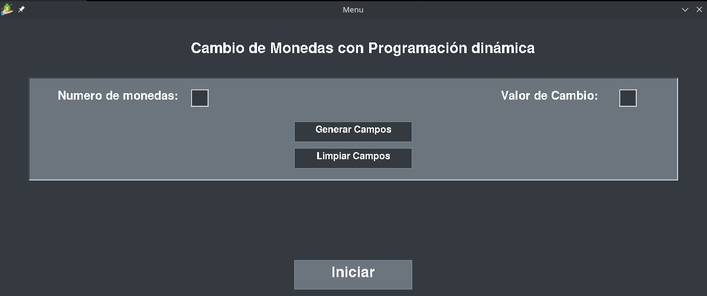
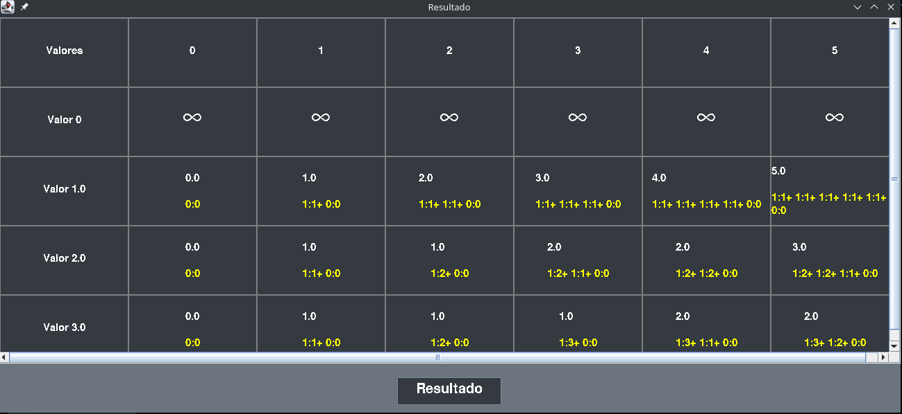

# Problema Cambio de monedas

Esta es una implementacion para resolver el problema de cambio de monedas con programacion dinamica.

## Autor

Sergio David Paez Suarez

## Documentación

En la carpeta doc se encontrara documentacion sobre el diseño para este programa (Aun realizandose)

## Ejecución

Otorgarle permisos de ejecucion al script de bash para compilar y ejecutar el proyecto, sino simplemente
compilar la clase main con `javac Main.java -d build`

Posteriormente entrar a la carpeta bin con `cd build` y ejecutar la clase Main con `java Main`

## Muestras de la aplicación

